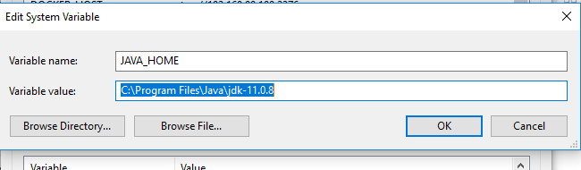
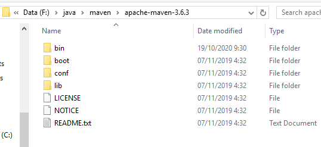
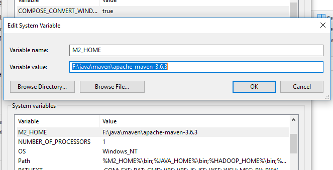
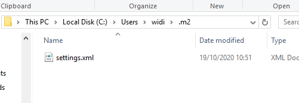
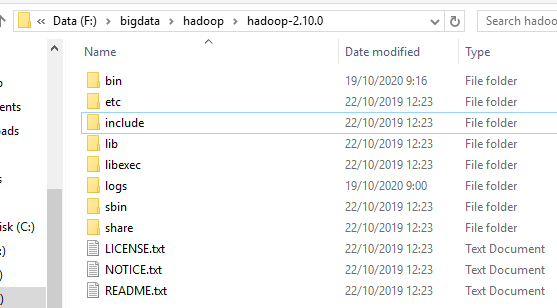
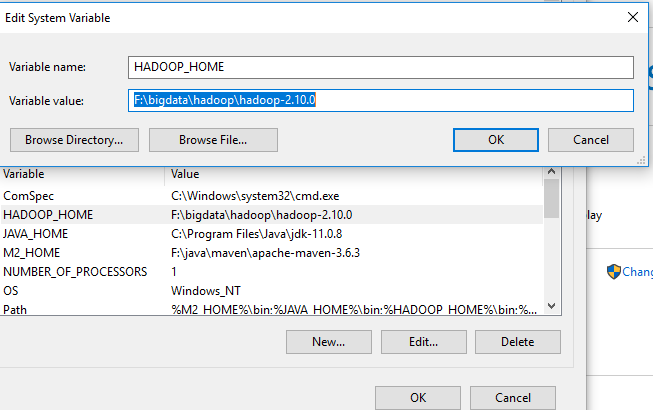
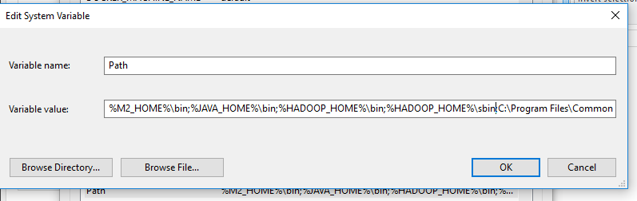
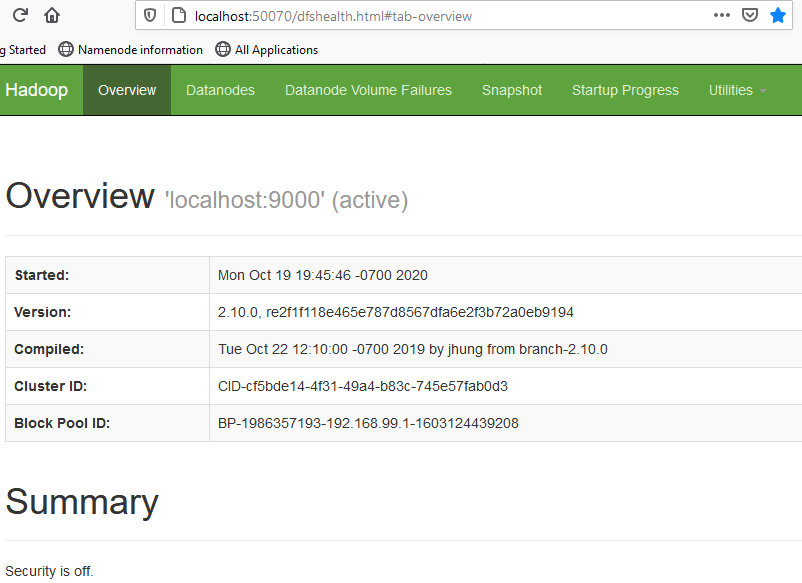
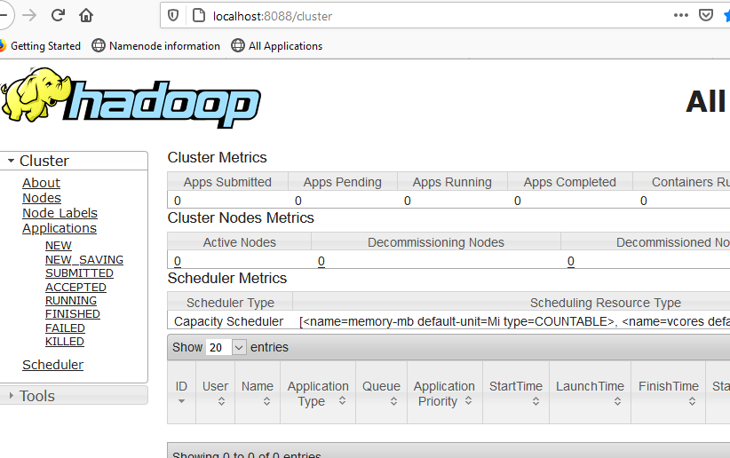

### Instalasi dan Konfigurasi Java
Download Java 1.8 dari Oracle Website dan instalasikan ke folder lokal
```url
https://www.oracle.com/java/technologies/javase/javase-jdk8-downloads.html
```
Konfigurasikan JAVA_HOME pada System Path



### Instalasi dan Konfigurasi Apache Maven
Download Apache Maven dari Apache Website dan instalasikan ke folder Anda misalkan ke F:\java\maven\apache-maven-3.6.3
```url
https://downloads.apache.org/maven/maven-3/3.6.3/binaries/apache-maven-3.6.3-bin.zip
```


Konfigurasikan Maven Home (M2_HOME)


Edit file settings.xml pada baris 55 isikan kode berikut
```xml
<localRepository>F:/java/maven/repo</localRepository>
```
Buat folder C:/User/{namaAnda}/.m2 , copy kan file settings.xml ke folder tersebut



### Instalasi dan Konfigurasi Hadoop
Download HADOOP dari Apache Website
```url
https://downloads.apache.org/hadoop/core/hadoop-2.10.1/hadoop-2.10.1.tar.gz
```
Ekstrak ke folder Anda yang akan menjadi HADOOP_HOME
misalkan ke F:\bigdata\hadoop\hadoop-2.10.0 sehingga terdapat struktur direktori seperti berikut 



Konfigurasikan HADOOP_HOME pada System Environment


#### Konfigurasikan etc/hadoop/hdfs-site.xml
```xml
<configuration>
<property>
    <name>dfs.namenode.name.dir</name>
    <value>F:\bigdata\data\hadoop-content\hdfs\namenode</value>
  </property>

  <property>
    <name>dfs.datanode.data.dir</name>
    <value>F:\bigdata\data\hadoop-content\hdfs\datanode</value>
  </property>
</configuration>
```

#### Edit etc/hadoop/core-site.xml:
```xml
<configuration>
 <property>
        <name>fs.defaultFS</name>
        <value>hdfs://localhost:9000</value>
    </property>
    <property>
        <name>hadoop.tmp.dir</name>
        <value>F:\bigdata\data\hadoop-content\hdfs\tmp</value>
    </property>
</configuration>
```
#### edit hadoop-env.cmd
```code
set JAVA_HOME="C:\\PROGRA~1\\Java\\jdk-11.0.8"
```

#### Edit mapred-site.xml
```xml
<configuration>
	<property>
		<name>mapreduce.framework.name</name>
		<value>yarn</value>
		<description>MapReduce framework name</description>
	</property>
</configuration>
```

#### Edit yarn-site.xml
```xml
<configuration>
	<property>
		<name>yarn.nodemanager.aux-services</name>
			<value>mapreduce_shuffle</value>
		<description>Yarn Node Manager Aux Service</description>
	</property>
</configuration>
```

### Konfigurasi Path
Konfigurasikan M2_HOME/bin, JAVA_HOME/bin, HADOOP_HOME/bin, dan HADOOP_HOME/sbin agar didaftarkan pada system Path
 

### Restart Sistem

#### Format File System
Format HDFS pertama kali
```shell
hdfs namenode -format
hdfs datanode -format
```
#### Start Hadoop
Start Hadoop PseudoCluster = Namenode + Datanode
```shell
start-dfs.cmd
```

Cek log Hadoop sehingga start HDFS selesai 


Cek HDFS melalui browser.
```url
http://localhost:50070/
```
Sehingga tampil seperti berikut.
 


Cek Cluster melalui browser
```url
http://localhost:8088/cluster
```
Sehingga tampil seperti berikut.
 


Stop Hadoop PseudoCluster
```shell
stop-dfs.cmd
```

Stop yarn
```shell
stop-yarn.cmd
```

### Percobaan menggunakan operasi Hadoop
Coba buat file melalui command prompt
```shell
hdfs dfs -mkdir /user
hdfs dfs -mkdir /user/widi
```

```shell
hdfs dfs -mkdir input
hdfs dfs -put etc/hadoop/*.xml input
hadoop jar share/hadoop/mapreduce/hadoop-mapreduce-examples-3.3.0.jar grep input output 'dfs[a-z.]+'
hdfs dfs -cat output/*

```

